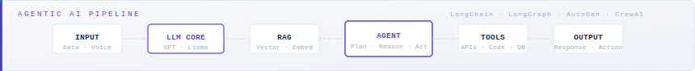

<!-- ============================================================
  Siddharth Yadav — GitHub Profile README
  Gen AI · Agentic AI · ML Research Engineer
  Design: Minimal · Professional · Light · Senior-level
============================================================ -->

<div align="center">

</div>

<br/>

<div align="center">

[](https://www.linkedin.com/in/siddharth-yadav-671244206/)&nbsp;
[](mailto:siddharthhyadav04@gmail.com)&nbsp;
[](https://leetcode.com/u/siddharthh04/)&nbsp;
[](https://github.com/siddhartth04)

</div>

---

### About

Software engineer and researcher focused on **Agentic AI**, **LLM systems**, and applied ML. Currently at **MANIT Bhopal** pursuing M.Tech in CSE, with research centered on advanced time-series learning frameworks. I work across the full stack — from low-level C++ systems to production LLM pipelines.

Core interests: autonomous agent architectures, RAG systems, transformer-based research, and building ML systems that ship.

---

### Agentic AI Stack

<div align="center">

</div>

<br/>

```
Orchestration    LangChain · LangGraph · AutoGen · CrewAI
Retrieval        RAG · FAISS · ChromaDB · Pinecone · Embeddings
LLM Providers    OpenAI API · Hugging Face · Llama · Mistral
Serving          FastAPI · Streamlit · REST · WebSockets
Observability    LangSmith · Prompt Engineering · Evals
```

---

### Technical Skills

<div align="center">

</div>

---

### Selected Work

<table>
<tr>
<td width="50%">

**GNSS Anomaly Detector**
`ML · Time-Series · Research`

High-performance anomaly detection for geodetic GNSS time-series data. Outperforms CNN/LSTM baselines with custom feature engineering and ensemble methods.

`97.9% AUC · 88.9% Accuracy`

</td>
<td width="50%">

**AI Receptionist — HIL System**
`LLM · Agentic · Voice`

Human-in-the-loop conversational AI with persistent memory, real-time STT, and LangChain-powered context tracking. Deployed via FastAPI.

`LangChain · FastAPI · Whisper · Python`

</td>
</tr>
<tr>
<td width="50%">

**Drone Navigation via RL**
`Reinforcement Learning · Robotics`

Autonomous navigation with hybrid PPO + A\* algorithm in a custom OpenAI Gym environment. Multi-objective reward shaping for efficiency and safety.

`PyTorch · OpenAI Gym · Python`

</td>
<td width="50%">

**Advanced Algo Bot**
`C++ · Systems · Finance`

Low-latency C++ trading bot ingesting live market data via libcurl and jsoncpp. Real-time signal generation with technical indicator computation.

`C++ · libcurl · jsoncpp · REST`

</td>
</tr>
<tr>
<td width="50%">

**Qwen3.5-9B Benchmark Suite**
`LLM Evaluation · Gen AI`

Comprehensive evaluation framework for Qwen3.5-9B across reasoning, math (GSM8K), coding (HumanEval, MBPP), safety (TruthfulQA), and long-context retrieval.

`Python · Jupyter · NLP · Benchmarking`

</td>
<td width="50%">

**Sorting Algorithm Visualizer**
`Systems · C++ · SDL2`

Real-time interactive visualizer for classic sorting algorithms — Bubble, Quick, Merge, Heap, Insertion, Selection — built with C++ and SDL2.

`C++ · SDL2 · Algorithms`

</td>
</tr>
</table>

---

### Research & Publications

**2 IEEE Publications** — computational intelligence, sensor fusion, and time-series ML.
Work presented and published through peer-reviewed IEEE conferences.

---

 

---

<div align="center">
<sub><code>Engineering intelligence — where clean code meets smart data.</code></sub>
</div>

<!-- ============================================================
  Files: hero.svg · skills.svg · pipeline.svg
  Upload all to root of siddhartth04/siddhartth04 repo
============================================================ -->
